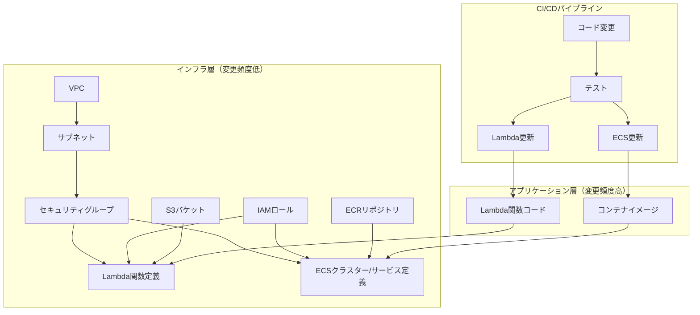
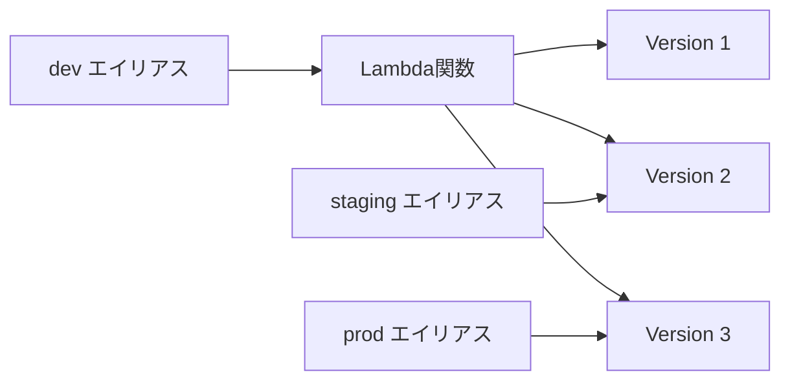
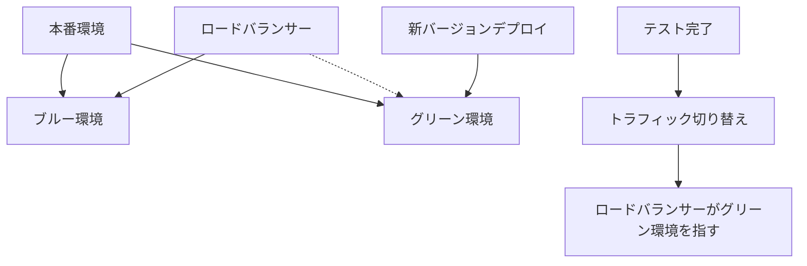
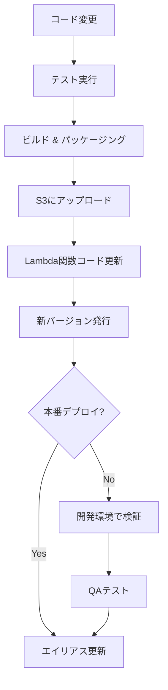

## AWSインフラ

- インフラにはプロジェクトの略称からなるプレフィックスをつける
- プレフィックスはプロジェクト直下の`README.md`で指定する
- 適切な指定が見当たらない場合は何にするべきか確認する
- 特に断りがない限り,
  データベースや`CloudWatch`ログは`cdk destroy`で同時に削除できるように設定する
- `CDK`のコードだけは`Node.js`で書くとし,
  特に`cdk init`を利用して初期化する

## インフラとアプリケーションの分離

### 全体アーキテクチャと分離の原則



### 分離の原則

1. **リポジトリ分離**:
   - インフラコード用リポジトリ（Terraform/CDK/CloudFormation）
   - アプリケーションコード用リポジトリ（Lambda関数、Dockerイメージ）

2. **デプロイパイプライン分離**:
   - インフラ変更用パイプライン（手動承認、慎重な変更）
   - アプリケーション更新用パイプライン（自動化、頻繁な更新）

3. **環境変数による設定分離**:
   - インフラ側：Parameter Store/Secrets Managerで管理
   - アプリケーション側：環境変数として参照

## Lambda関数の更新ベストプラクティス

### Lambda関数コードの更新方法

```bash
# ZIPファイルから直接更新
aws lambda update-function-code \
  --function-name ${PREFIX}-my-function \
  --zip-file fileb://function.zip

# または、S3経由で更新
aws lambda update-function-code \
  --function-name ${PREFIX}-my-function \
  --s3-bucket my-deployment-bucket \
  --s3-key functions/my-function.zip
```

### バージョニングとエイリアスの活用



```bash
# 新しいバージョンを発行
aws lambda publish-version \
  --function-name ${PREFIX}-my-function \
  --description "Production release - 2023-03-22"

# エイリアスを更新
aws lambda update-alias \
  --function-name ${PREFIX}-my-function \
  --name production \
  --function-version 3
```

### カナリアデプロイ

```bash
# トラフィックの10%をバージョン4に、90%をバージョン3に振り分け
aws lambda update-alias \
  --function-name ${PREFIX}-my-function \
  --name production \
  --function-version 3 \
  --routing-config '{"AdditionalVersionWeights":{"4":0.1}}'
```

## ECSサービスの更新ベストプラクティス

### コンテナイメージの更新

```bash
# イメージをビルド
docker build -t ${ECR_REPO_URI}:${IMAGE_TAG} .

# ECRにログイン
aws ecr get-login-password --region ap-northeast-1 | \
  docker login --username AWS --password-stdin ${ECR_REPO_URI}

# イメージをプッシュ
docker push ${ECR_REPO_URI}:${IMAGE_TAG}
```

### タスク定義の更新

```bash
# 現在のタスク定義を取得
aws ecs describe-task-definition \
  --task-definition ${PREFIX}-service \
  --query taskDefinition > task-definition.json

# イメージを更新（jqを使用）
jq '.containerDefinitions[0].image = "'${ECR_REPO_URI}':'${IMAGE_TAG}'"' \
  task-definition.json > new-task-definition.json

# 新しいタスク定義を登録
NEW_TASK_DEF=$(aws ecs register-task-definition \
  --cli-input-json file://new-task-definition.json \
  --query 'taskDefinition.taskDefinitionArn' \
  --output text)
```

### サービスの更新

```bash
# サービスを更新
aws ecs update-service \
  --cluster ${PREFIX}-cluster \
  --service ${PREFIX}-service \
  --task-definition ${NEW_TASK_DEF} \
  --force-new-deployment
```

### ブルー/グリーンデプロイ



## CI/CDパイプラインの実装

### CI/CDパイプラインでのLambda更新フロー



### GitHub Actionsでの実装例（Lambda）

```yaml
name: Deploy Lambda Function

on:
  push:
    branches: [ main ]
    paths:
      - 'src/lambda-functions/my-function/**'

jobs:
  deploy:
    runs-on: ubuntu-latest
    steps:
      - uses: actions/checkout@v3

      - name: Set up Node.js
        uses: actions/setup-node@v3
        with:
          node-version: '18'

      - name: Install dependencies
        run: |
          cd src/lambda-functions/my-function
          npm ci

      - name: Run tests
        run: |
          cd src/lambda-functions/my-function
          npm test

      - name: Build and package
        run: |
          cd src/lambda-functions/my-function
          npm run build
          zip -j function.zip dist/*

      - name: Configure AWS credentials
        uses: aws-actions/configure-aws-credentials@v1
        with:
          aws-access-key-id: ${{ secrets.AWS_ACCESS_KEY_ID }}
          aws-secret-access-key: ${{ secrets.AWS_SECRET_ACCESS_KEY }}
          aws-region: ap-northeast-1

      - name: Update Lambda function code
        run: |
          aws lambda update-function-code \
            --function-name ${PREFIX}-my-function \
            --zip-file fileb://src/lambda-functions/my-function/function.zip

      - name: Publish new version
        id: publish-version
        run: |
          VERSION=$(aws lambda publish-version \
            --function-name ${PREFIX}-my-function \
            --description "Deployment from GitHub Actions - ${{ github.sha }}" \
            --output json | jq -r '.Version')
          echo "::set-output name=version::$VERSION"

      - name: Update staging alias
        run: |
          aws lambda update-alias \
            --function-name ${PREFIX}-my-function \
            --name staging \
            --function-version ${{ steps.publish-version.outputs.version }}
```

### GitHub Actionsでの実装例（ECS）

```yaml
name: Deploy ECS Service

on:
  push:
    branches: [ main ]
    paths:
      - 'src/ecs-services/my-service/**'

jobs:
  deploy:
    runs-on: ubuntu-latest
    steps:
      - uses: actions/checkout@v3

      - name: Configure AWS credentials
        uses: aws-actions/configure-aws-credentials@v1
        with:
          aws-access-key-id: ${{ secrets.AWS_ACCESS_KEY_ID }}
          aws-secret-access-key: ${{ secrets.AWS_SECRET_ACCESS_KEY }}
          aws-region: ap-northeast-1

      - name: Login to Amazon ECR
        id: login-ecr
        uses: aws-actions/amazon-ecr-login@v1

      - name: Build, tag, and push image to Amazon ECR
        id: build-image
        env:
          ECR_REGISTRY: ${{ steps.login-ecr.outputs.registry }}
          ECR_REPOSITORY: ${PREFIX}-my-service
          IMAGE_TAG: ${{ github.sha }}
        run: |
          cd src/ecs-services/my-service
          docker build -t $ECR_REGISTRY/$ECR_REPOSITORY:$IMAGE_TAG .
          docker push $ECR_REGISTRY/$ECR_REPOSITORY:$IMAGE_TAG
          echo "::set-output name=image::$ECR_REGISTRY/$ECR_REPOSITORY:$IMAGE_TAG"

      - name: Download task definition
        run: |
          aws ecs describe-task-definition \
            --task-definition ${PREFIX}-my-service \
            --query taskDefinition > task-definition.json

      - name: Update task definition
        id: task-def
        uses: aws-actions/amazon-ecs-render-task-definition@v1
        with:
          task-definition: task-definition.json
          container-name: app
          image: ${{ steps.build-image.outputs.image }}

      - name: Deploy to Amazon ECS
        uses: aws-actions/amazon-ecs-deploy-task-definition@v1
        with:
          task-definition: ${{ steps.task-def.outputs.task-definition }}
          service: ${PREFIX}-my-service
          cluster: ${PREFIX}-cluster
          wait-for-service-stability: true
```

## 環境変数と設定管理

### Parameter Store/Secrets Managerの活用

```bash
# Parameter Storeに設定を保存
aws ssm put-parameter \
  --name "/${PREFIX}/api/endpoint" \
  --value "https://api.example.com" \
  --type String

# Secrets Managerに機密情報を保存
aws secretsmanager create-secret \
  --name "/${PREFIX}/db/password" \
  --secret-string "MySecretPassword"
```

## デプロイ後の検証とモニタリング

### CloudWatch Alarmsでの監視

```bash
# Lambda関数のエラー率アラーム
aws cloudwatch put-metric-alarm \
  --alarm-name ${PREFIX}-lambda-errors \
  --alarm-description "Alarm when error rate exceeds 1%" \
  --metric-name Errors \
  --namespace AWS/Lambda \
  --statistic Sum \
  --period 60 \
  --threshold 1 \
  --comparison-operator GreaterThanThreshold \
  --dimensions Name=FunctionName,Value=${PREFIX}-my-function \
  --evaluation-periods 1 \
  --alarm-actions arn:aws:sns:ap-northeast-1:123456789012:alerts
```

## ロールバック戦略

### Lambda関数のロールバック

```bash
# 以前のバージョンにエイリアスを戻す
aws lambda update-alias \
  --function-name ${PREFIX}-my-function \
  --name production \
  --function-version ${PREVIOUS_VERSION}
```

### ECSサービスのロールバック

```bash
# 以前のタスク定義に戻す
aws ecs update-service \
  --cluster ${PREFIX}-cluster \
  --service ${PREFIX}-service \
  --task-definition ${PREFIX}-my-service:${PREVIOUS_REVISION} \
  --force-new-deployment
```

## セキュリティのベストプラクティス

1. **最小権限の原則**:
   - Lambda実行ロールとECSタスク実行ロールに必要最小限の権限のみ付与

2. **シークレット管理**:
   - 機密情報はコードに埋め込まず、Secrets Managerで管理

3. **イメージスキャン**:
   - ECRの自動スキャン機能を有効化
   - デプロイ前にセキュリティ脆弱性をチェック

4. **コード品質**:
   - 静的解析ツールをCI/CDパイプラインに組み込む
   - SonarQube、ESLint、Security Lintなどを活用
