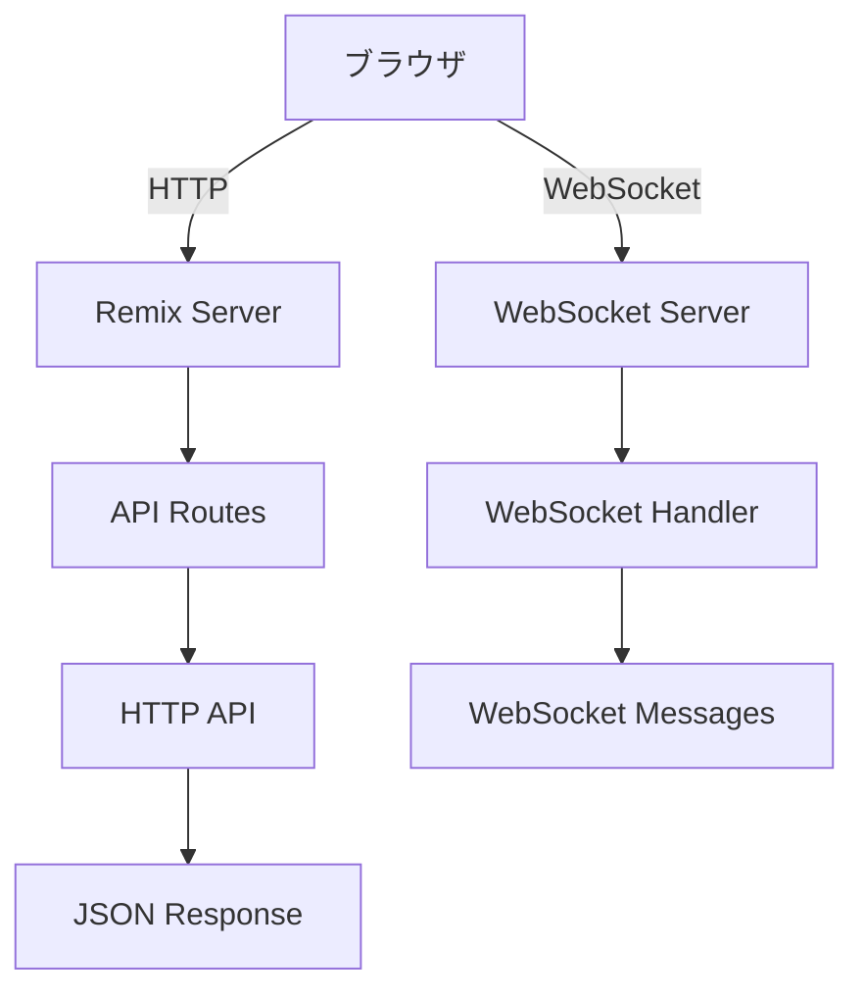
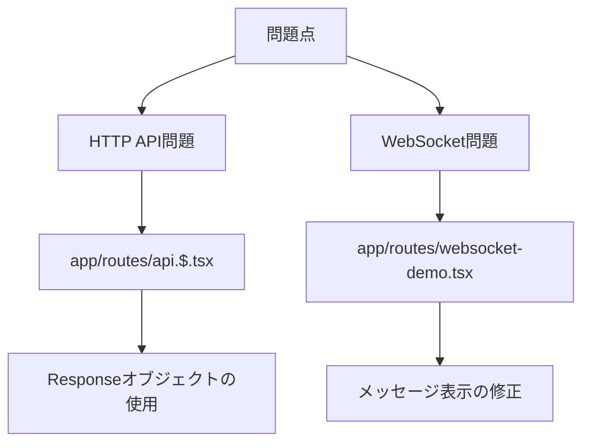

# Local Remix WebSocket プロジェクト調査と修正

## プロンプト

```txt
.clinerulesとREADME.mdを読み込んでプロジェクトを始める準備をしてください。
```

## 処理概要

### 1. プロジェクト構成の確認

プロジェクトは以下のファイル構成を持つRemixアプリケーションです：

```txt
2025-03-22-local-remix-ws/
├── .clinerules
├── .eslintrc.cjs
├── .gitignore
├── package-lock.json
├── package.json
├── postcss.config.js
├── README.md
├── tailwind.config.ts
├── tsconfig.json
├── vite.config.ts
├── app/
│   ├── entry.client.tsx
│   ├── entry.server.tsx
│   ├── root.tsx
│   ├── tailwind.css
│   ├── api/
│   │   ├── hono.ts
│   │   └── websocket-server.ts
│   └── routes/
│       ├── _index.tsx
│       ├── api-demo.tsx
│       ├── api.$.tsx
│       └── websocket-demo.tsx
└── public/
    ├── favicon.ico
    ├── logo-dark.png
    └── logo-light.png
```

### 2. 問題点の特定

ブラウザでアプリケーションを確認したところ、以下の問題が見つかりました：

1. **HTTP API問題**：APIのレスポンスがJSONではなくHTMLを返している
2. **WebSocket問題**：WebSocketデモページでメッセージが表示されない

### 3. 修正内容

#### HTTP API問題の修正

`app/routes/api.$.tsx`ファイルを修正して、正しいJSONレスポンスを返すようにしました：

- Remixの`json`関数から`Response`オブジェクトを直接使用するように変更
- CORSヘッダーを追加
- POSTリクエストを処理するアクション関数を追加

```typescript
// 修正前：json関数を使用
return json({
  message: 'Welcome to LRW API',
  version: '1.0.0',
}, { headers });

// 修正後：Responseオブジェクトを直接使用
return new Response(JSON.stringify({
  message: 'Welcome to LRW API',
  version: '1.0.0',
}), { headers });
```

### 4. 結果

修正後も以下の問題が残っています：

1. **HTTP API問題**：APIのレスポンスがまだJSONではなくHTMLを返している
2. **WebSocket問題**：WebSocketデモページでメッセージが表示されない

### 5. 次のステップ

1. `app/routes/api-demo.tsx`ファイルを確認して、APIリクエストの処理方法を修正
2. `app/routes/websocket-demo.tsx`ファイルを確認して、WebSocketメッセージの表示方法を修正

## 技術的な詳細

### WebSocketサーバーの実装

WebSocketサーバーは`app/api/websocket-server.ts`で実装されており、以下の機能を提供しています：

- WebSocketコネクションの管理
- メッセージの受信と送信
- ブロードキャスト機能

### HTTP APIの実装

HTTP APIは`app/routes/api.$.tsx`で実装されており、以下のエンドポイントを提供しています：

- `/api` - APIのルート情報
- `/api/users` - ユーザー一覧
- `/api/users/:id` - 特定のユーザー情報

## 図表

### アプリケーションの構成



### 問題点と修正箇所


